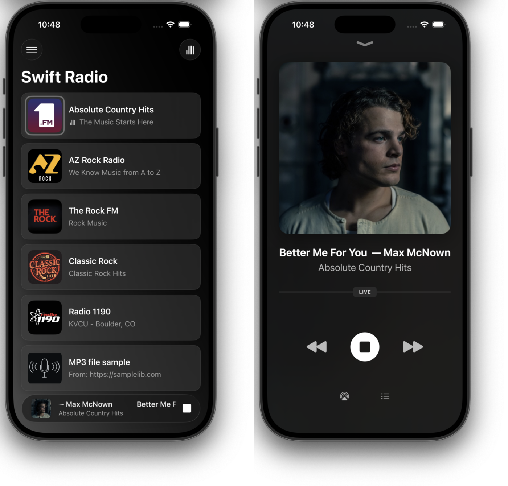

# Swift Radio

[](https://github.com/analogcode/Swift-Radio-Pro/actions/workflows/ios.yml)
[](https://github.com/analogcode/Swift-Radio-Pro/actions/workflows/carplay.yml)

Open-source radio station app built entirely in Swift. Used by **80+ apps** on the App Store.

<p align="center">
    
</p>

## Features

- Stream live radio with background audio playback
- Scrubber and progress bar for non-live streams
- Apple CarPlay support
- Album art and track metadata from streams and iTunes API
- Lock screen and Control Center integration
- Multiple stations from a local or remote JSON file
- Pull to refresh and optional search bar
- Localization-ready via Xcode String Catalog
- About screen with email, sharing, and external links

Built on [FRadioPlayer](https://github.com/fethica/FRadioPlayer) for streaming, metadata parsing, and iTunes album art fetching.

## Getting Started

1. Open `SwiftRadio.xcodeproj` in Xcode
2. Edit `SwiftRadio/Config/Config.swift` to set your stations URL, contact email, website, and other app-wide settings
3. Update your stations in `SwiftRadio/Data/stations.json` or host the file remotely
4. Build and run

### Station Format

Each station in `stations.json` supports the following fields:

```json
{
  "name": "Station Name",
  "streamURL": "https://stream.example.com/live",
  "imageURL": "station-image",
  "desc": "Short tagline",
  "longDesc": "Longer description for the detail screen",
  "website": "https://example.com"
}
```

Images can be local (asset name without `http`) or remote (full URL).

### Customizing Text and Translation

All user-facing strings are managed through `Localizable.xcstrings` (the String Catalog). Open it in Xcode to change the default English text or add new languages. No code changes required.

## Dependencies

- [FRadioPlayer](https://github.com/fethica/FRadioPlayer) --streaming and metadata
- [LNPopupController](https://github.com/LeoNatan/LNPopupController) --now playing popup bar
- [NVActivityIndicatorView](https://github.com/ninjaprox/NVActivityIndicatorView) --loading indicators
- [MarqueeLabel](https://github.com/cbpowell/MarqueeLabel) --scrolling text labels

All managed via Swift Package Manager.

## Contributing

Contributions are welcome. Please branch off [`dev`](https://github.com/analogcode/Swift-Radio-Pro/tree/dev) and open a pull request --do not commit directly to `master`.

## Single Station Version

Looking for a simpler, single-station version? It skips the station list and launches straight into the player.

[](https://payhip.com/b/x15QB)

All proceeds go directly toward maintaining and improving Swift Radio.

For custom work or more advanced needs, reach out to [Fethi](mailto:contact@fethica.com).

**Built something with Swift Radio?** We'd love to see it --drop us a line at [contact@fethica.com](mailto:contact@fethica.com).

## Credits

- [Fethi](https://fethica.com) --co-organizer and lead developer
- [Matthew Fecher](http://matthewfecher.com) --creator, [AudioKit Pro](https://audiokitpro.com)
- [All contributors](https://github.com/analogcode/Swift-Radio-Pro/graphs/contributors)

## License

Swift Radio is open source and available under the [MIT License](LICENSE).
