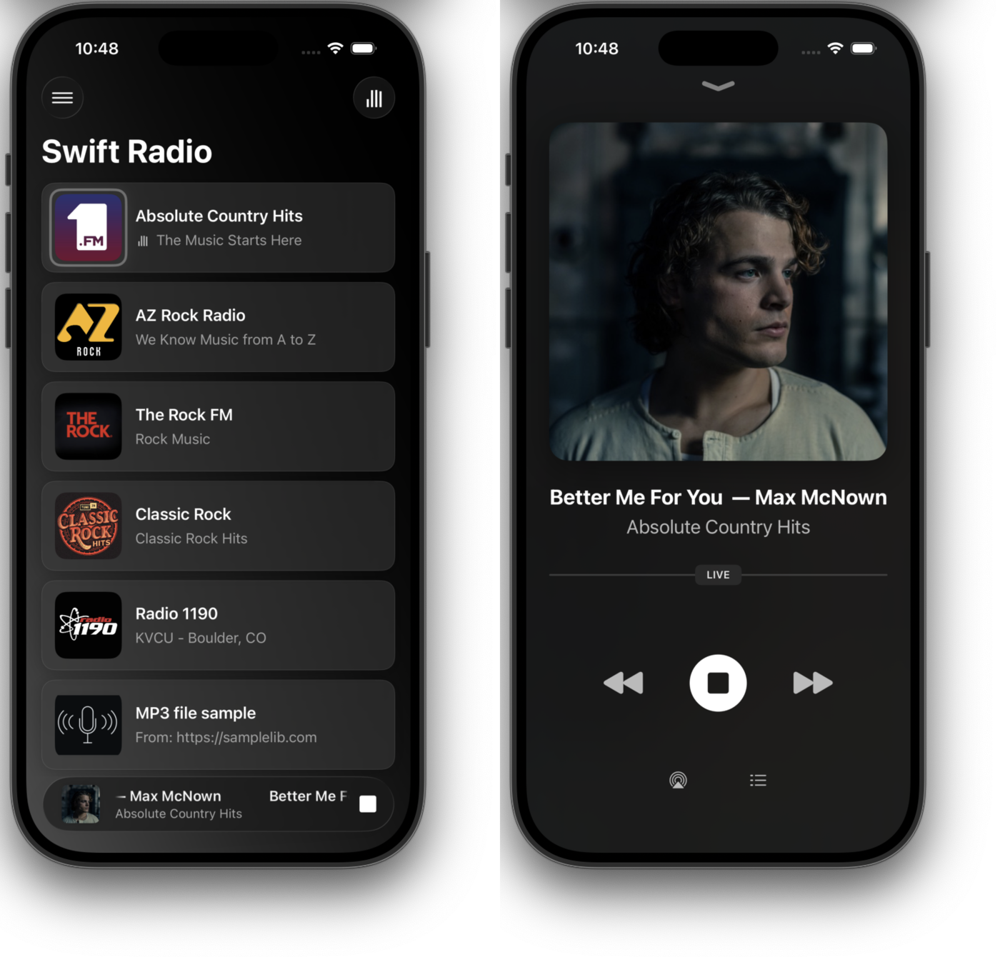

# Swift Radio

[](https://github.com/analogcode/Swift-Radio-Pro/actions/workflows/ios.yml)
[](https://github.com/analogcode/Swift-Radio-Pro/actions/workflows/carplay.yml)

Open-source radio station app built entirely in Swift and SwiftUI. Used by **80+ apps** on the App Store.

<p align="center">
    
</p>

**Looking for Android?** See [Swift Radio Android](https://github.com/fethica/Swift-Radio-Android). Same station format, native Kotlin and Jetpack Compose.

## Features

- Stream live radio with background audio playback
- Scrubber and progress bar for non-live streams
- Apple CarPlay support
- Album art and track metadata from streams and iTunes API
- Lock screen and Control Center integration
- Multiple stations from a local or remote JSON file
- Pull to refresh and optional search bar
- Localization-ready via Xcode String Catalog
- About screen with email, sharing, and external links

Built on [FRadioPlayer](https://github.com/fethica/FRadioPlayer) for streaming, metadata parsing, and iTunes album art fetching.

## Requirements

- **iOS 17 or later**: the deployment target of the app target, the CarPlay target, and the `SwiftRadioCore` package.
- **Xcode 26.6 or later**: CI builds the app and CarPlay targets with Xcode 26.6 and 27.0. The test suites are run with Xcode 27.
- **Swift 6 language mode**: every target compiles with `SWIFT_VERSION = 6.0` and `SWIFT_STRICT_CONCURRENCY = complete`.

Dependencies resolve through Swift Package Manager, so there's nothing to install before the first build.

## Getting Started

1. Open `SwiftRadio.xcodeproj` in Xcode
2. Edit `SwiftRadio/Config/Config.swift` to set your stations URL, contact email, website, and other app-wide settings
3. Update your stations in `SwiftRadio/Data/stations.json` or host the file remotely
4. Build and run

### Adding a station

1. Add an entry to `SwiftRadio/Data/stations.json`, or to the JSON you host at `Config.stationsURL`
2. Add a square image to `SwiftRadio/Images.xcassets/Stations/` and name the image set exactly like the station's `imageURL`
3. Build and run: no code change is needed

Each station supports these fields:

```json
{
  "name": "Station Name",
  "streamURL": "https://stream.example.com/live",
  "imageURL": "station-image",
  "desc": "Short tagline",
  "longDesc": "Longer description for the detail screen",
  "website": "https://example.com"
}
```

- **`imageURL`**: an asset name for a bundled image, a full `http(s)` URL for a remote one, or an empty string to fall back to the `stationImage` placeholder.
- **`website`**: optional. The "Visit Website" row and the popup's website option appear only when it starts with `http` or `https`.
- **`longDesc`**: optional. Omit the key or leave it empty and the station info screen shows a default description.

### Forking for one station

The template works at any catalog size, so a single-station app is mostly configuration:

- **Trim the catalog**: leave one entry in `stations.json` and keep `Config.useLocalStations = true`.
- **Drop the controls it doesn't need**: set `Config.hideNextPreviousButtons = true` and leave `Config.searchable = false`.
- **Open on the player**: call `StationsStore.select(_:)` once the catalog loads and set `RootView`'s `popupOpen` to `true`. The one-row list stays behind the player as the back destination.
- **Rebrand**: replace `logo` and the station image in `Images.xcassets`, then edit the strings in `Localizable.xcstrings`.

### Customizing text and translation

All user-facing strings are managed through `Localizable.xcstrings` (the String Catalog). Open it in Xcode to change the default English text or add new languages. Most views read their strings through `Content.swift`; a few accessibility labels in the player and toolbar use their catalog keys directly (`player.next`, `player.seek`, `common.close` and similar). Either way the text lives in the catalog, so a translation needs no code change.

## Architecture

Screens and navigation use SwiftUI. UIKit remains at focused boundaries: CarPlay, the popup library, system presentations (Safari, mail, AirPlay and sharing), and small wrappers that keep the reference appearance and native accessibility: the seek slider, the gradient, the marquee title (`MarqueeText`), the equalizer and buffering indicators (`PlaybackActivityIndicator`), and the artwork containers (`CrossfadeImage`, `PlaybackArtworkImage`). Playback state stays outside those wrappers.

```
SwiftRadio/
  App/         SwiftRadioApp (@main), AppDelegate, AppEnvironment, RootView,
               ConfiguredStationsLoader, ArtworkLoaderKey, UITestRadioPlayer (Debug only)
  CarPlay/     CarPlaySceneDelegate and its observation helper
  Config/      Config, Content (String Catalog keys), InfoSection
  Data/        stations.json
  Features/    One folder per screen: Loading, Stations, NowPlaying, StationInfo, About
  Helpers/     Small Foundation extensions
  UI/          Views shared across screens: artwork, gradient, marquee, equalizer,
               AirPlay, Safari, mail, share sheet, share card
  Images.xcassets, Localizable.xcstrings, Info.plist, Info-CarPlay.plist

Packages/SwiftRadioCore/
  Models/      RadioStation, StationsResponse
  Stations/    StationsStore, the loader protocol, bundle and remote loaders,
               CatalogListContent (what a size-limited list shows)
  Playback/    PlayerService, the FRadioPlayer boundary, audio session, now playing info,
               remote commands
  Images/      ArtworkLoader
  Handoff/     HandoffActivity
```

- **`AppEnvironment`**: builds one `PlayerService`, one `StationsStore`, and one `ArtworkLoader` at launch. The phone scene and the CarPlay scene share those instances, so a station picked in the car updates the phone, the lock screen, and Control Center.
- **`RootView`**: shows `LoadingScreen` until the first catalog load settles, then a `NavigationStack` holding the station list, a `navigationDestination` for station info, and the popup player.
- **`SwiftRadioCore`**: a local Swift package that holds the models, the stores, and the only import of FRadioPlayer. It has no SwiftUI in it and carries the unit tests.
- **CarPlay**: the `SwiftRadio-CarPlay` target compiles the same sources with `-D CarPlay` and swaps in `Info-CarPlay.plist`. `CarPlaySceneDelegate` renders a `CPListTemplate` from the shared store:
  - **Catalog states**: a loading message while the first load runs, and a Retry row when loading failed or the catalog is empty, so the driver can recover without the phone.
  - **Item limit**: the list shows at most `CPListTemplate.maximumItemCount` stations, which some cars lower while driving.
  - **Selection**: tapping a station pushes the Now Playing template. Tapping the station that is already playing or buffering doesn't restart its stream, and a station whose stream URL can't be opened is ignored.

### The popup player

[LNPopupUI](https://github.com/LeoNatan/LNPopupUI) draws the bar above the station list and expands it into the full player.

- **Presentation**: `RootView` attaches `.popup(isBarPresented:isPopupOpen:)` to the `NavigationStack`. The bar shows whenever `StationsStore.currentStation` is set, including when CarPlay made the selection.
- **Bar content**: `NowPlayingView` feeds the title, artwork, progress, and play/pause button to the bar through `.popupTitle`, `.popupImage`, `.popupProgress`, and `.popupBarButtons`.
- **Full player**: the same view's body is the expanded content: blurred artwork backdrop, marquee title, transport controls, and the options sheet.
- **Sequencing**: options that leave the player (station info, station website) wait for the options sheet's `onDismiss`, close the popup, then run from `onClose`, so a push or a sheet never fights either dismissal animation.

### Audio session and system controls

- **Session**: `PlayerService` activates a non-mixable `.playback` session right before it loads, plays or seeks, never at launch. Opening the app doesn't stop other apps' audio; starting a station does.
- **Mixing**: set `Config.mixesWithOtherAudio = true` to keep other audio playing under the radio. A mixable session can't own the lock screen, Control Center or CarPlay Now Playing, so those controls stop working.
- **Remote commands**: live streams enable Stop and disable Pause, files do the opposite. Play, play/pause, next and previous stay enabled. With no station selected every command reports `.noActionableNowPlayingItem` and does nothing.
- **Now Playing info**: each update replaces the whole dictionary, so a live stream never keeps a file's scrubber or an old track's artwork. Clock ticks don't republish it: the system advances elapsed time from the published rate.

### Testing

Run the core package tests from `Packages/SwiftRadioCore` (see its README for the command). They need no network and cover playback, remote commands, Now Playing info, interruptions and the catalog.

For visual changes, use the [visual parity protocol](Documentation/SwiftUIParity.md): matching simulator screenshots, accessibility checks and the UI test commands. The [core package guide](Packages/SwiftRadioCore/README.md) documents dependency ownership.

## Dependencies

| Library | Purpose |
|---------|---------|
| [FRadioPlayer](https://github.com/fethica/FRadioPlayer) | Streaming, metadata parsing, iTunes album art |
| [LNPopupUI](https://github.com/LeoNatan/LNPopupUI) | Now playing popup bar and player |
| [MarqueeLabel](https://github.com/cbpowell/MarqueeLabel) | Continuous now-playing title, matching the UIKit app |
| [NVActivityIndicatorView](https://github.com/ninjaprox/NVActivityIndicatorView) | Equalizer and buffering animations, matching the UIKit app |

All are managed by Swift Package Manager. LNPopupUI brings LNPopupController and LNSwiftUIUtils with it. `SwiftRadioCore` lives in this repo as a local package and needs no setup. The two animation libraries are isolated behind small SwiftUI adapters; application state and navigation remain in SwiftUI.

## Contributing

Contributions are welcome. Please branch off [`dev`](https://github.com/analogcode/Swift-Radio-Pro/tree/dev) and open a pull request. Do not commit directly to `master`.

## Single Station Version

Looking for a simpler, single-station version? It skips the station list and launches straight into the player. One purchase now includes **both the iOS and Android** single-station projects.

[](https://payhip.com/b/x15QB)

All proceeds go directly toward maintaining and improving Swift Radio.

For custom work or more advanced needs, reach out to [Fethi](mailto:contact@fethica.com).

**Built something with Swift Radio?** We'd love to see it. Drop us a line at [contact@fethica.com](mailto:contact@fethica.com).

## Credits

- [Fethi](https://fethica.com), co-organizer and lead developer
- [Matthew Fecher](http://matthewfecher.com), creator, [AudioKit Pro](https://audiokitpro.com)
- [All contributors](https://github.com/analogcode/Swift-Radio-Pro/graphs/contributors)

## License

Swift Radio is open source and available under the [MIT License](LICENSE).
